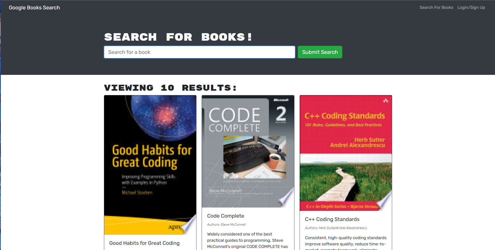

# Book Search Engine Starter Code

## Description

---

Book Search Engine that was fully functioning. The task of this assignment was to refactor the code to be a GraphQL API built with the Apollo Server. 

The application was built using the MERN Stack. 

## Table of Contents

---
- [Preview](#preview)
- [Technology](#technology)
- [Portfolio](#portfolio)
- [Authors](#authors)

## Preview 

---

## Deployment

---

Heroku Application will soon be deployed here

## Authors

---

- Tony Tran
  - [GitHub](https://github.com/tonytran97)